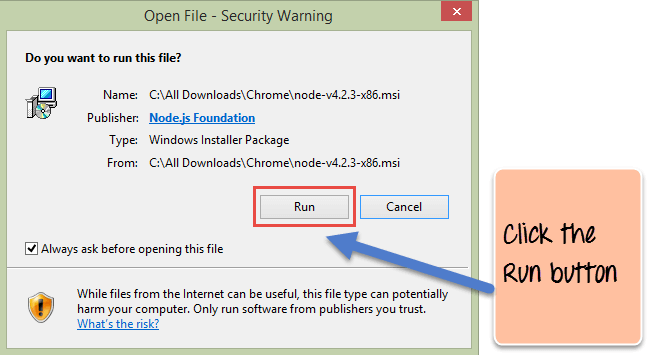
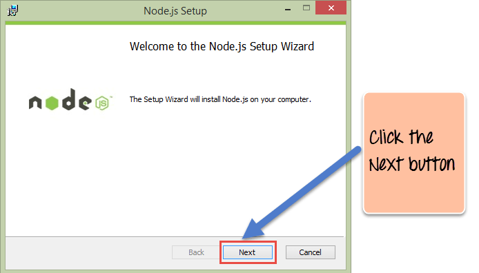
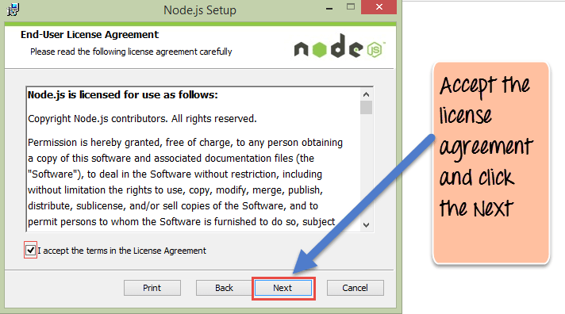
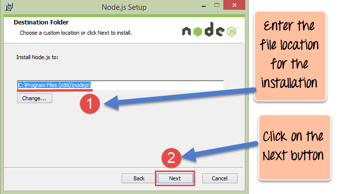
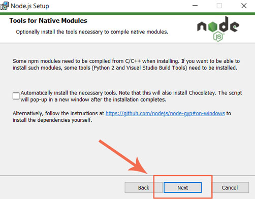
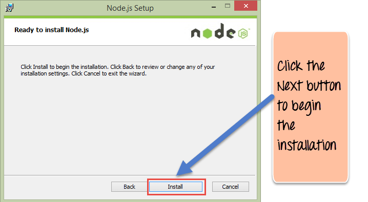
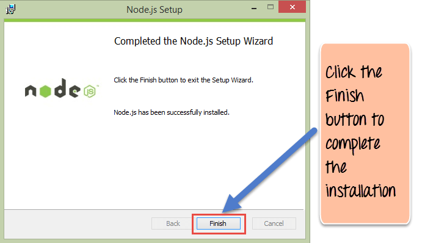
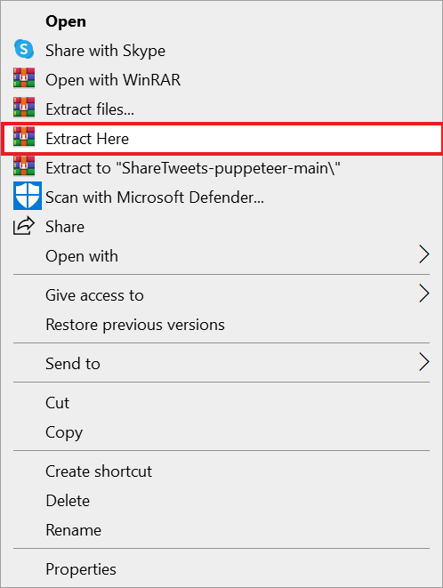

# ShareTweets
>How to start كيف تبدأ

> **Step 1** 

Open this link  **[Node link]("https://nodejs.org/en/download/")**  افتح هذا الرابط

Click on Windows Installer or macOS Installer 
 
 

---
> **Step 2** 

Open this link  **[Code link]("https://github.com/Mohammad-W-Momani/ShareTweets-puppeteer")**  افتح هذا الرابط

Click on Download ZIP

> **Step 3** 

Click on ShareTweets-puppeteer-main.zip then Extract files    
ShareTweets-puppeteer-main.zip انقر على ثم استخرج الملفات

 
> **Step 4**    

Click on ShareTweets-puppeteer-main  file then copy the path

ثم انسخ المسار ShareTweets-puppeteer-main  انقر على ملف

> **Step 5**  

1. Open command Prompt 

2. Type cd the path who copied  
ثم  المسار الذي نسخته cd اكتب 

Type **npm i** اكتب 

Open userInformation file

Change the information 

then save the file ثم احفظ الملف

> **Final Step**  
Type **npm test** اكتب

